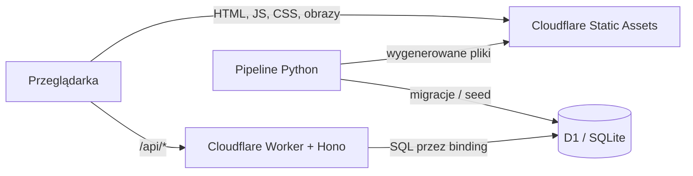
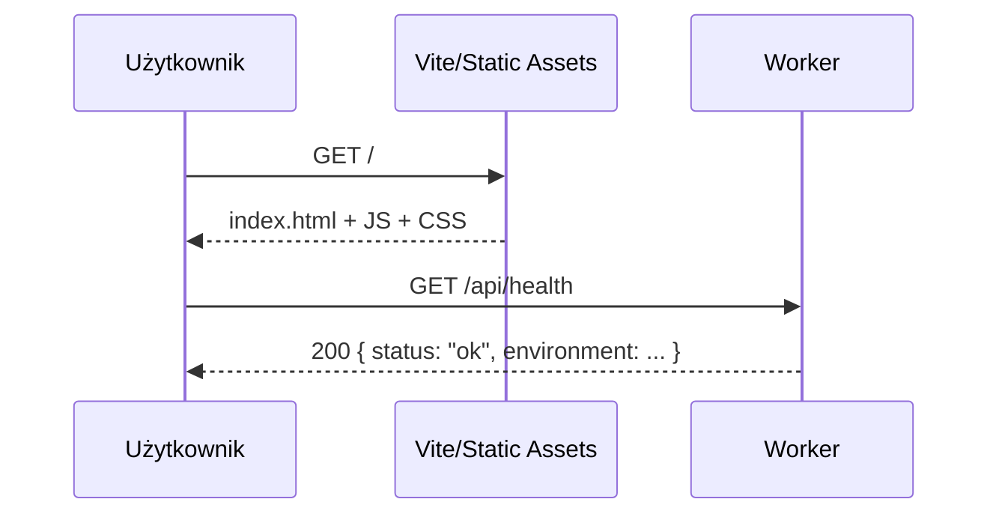

# Architektura serwisu

Ten dokument wyjaśnia działanie GEOLUKITUKI od wpisania adresu w przeglądarce do
zapisu wyniku. Jest aktualizowany razem z implementacją.

## Najważniejsza idea

Projekt ma jeden publiczny punkt wejścia: Cloudflare Worker. Pod tym samym adresem
dostępne są pliki strony i API. Dzięki temu nie konfigurujemy osobnej domeny API,
CORS ani dwóch niezależnych wdrożeń.

### Przeglądarka

React odpowiada za ekran, nawigację i stan interfejsu. Vite buduje kod do zestawu
statycznych plików HTML, JavaScript i CSS. Przeglądarka może znać aktualną rundę,
obraz i wykonany strzał, ale docelowo nie otrzymuje odpowiedzi przed strzałem.

### Static Assets

Cloudflare przechowuje wynik komendy `vite build`. Pasujące pliki są zwracane bez
uruchamiania kodu Workera, więc takie żądania nie zużywają dziennego limitu
wywołań Workera. Reguła `not_found_handling: single-page-application` zwraca
`index.html` dla tras aplikacji, np. `/game`.

### Worker

Worker jest małym programem TypeScript uruchamianym na infrastrukturze Cloudflare.
Hono pełni rolę routera: łączy metodę i ścieżkę HTTP z właściwą funkcją. Endpoint
`GET /api/health` potwierdza, że API działa. Worker wybiera rundy, przyjmuje
strzały i liczy punkty dla trybu satelitarnego oraz metra. Przeglądarka podaje
tylko tryb, nick i współrzędne strzału — nigdy własny wynik.

Worker nie ma hasła do D1 w zmiennej środowiskowej. `binding` o nazwie `DB` jest
uprawnieniem wstrzykiwanym przez Cloudflare. Kod wywołuje `env.DB.prepare(...)`,
a platforma kieruje zapytanie do przypisanej bazy.

### D1

D1 to zarządzana baza zgodna z SQLite. Strukturę bazy opisują numerowane pliki SQL
w `migrations/`. Ta sama migracja jest uruchamiana lokalnie, na preview i na
produkcji, ale każde środowisko przechowuje inne dane.

## Przepływ żądania w M0

W środowisku lokalnym są dwa procesy. Vite działa na porcie 5173, Worker na 8787,
a proxy Vite przekazuje ścieżki `/api` do Workera. Po wdrożeniu oba elementy mają
jeden adres i proxy nie jest potrzebne.

## Środowiska i izolacja danych

| Środowisko | Worker                            | D1                      | Zastosowanie        |
| ---------- | --------------------------------- | ----------------------- | ------------------- |
| Local      | proces `wrangler dev`             | pliki w `.wrangler/`    | praca na komputerze |
| Preview    | `golukituki-preview`              | `golukituki-preview`    | gałęzie i PR-y      |
| Production | `golukituki` (`--env production`) | `golukituki-production` | gałąź `main`        |

Rozdzielenie D1 jest istotne: testowa gra z podglądu nie może trafić do rankingu
produkcyjnego. Wartości `database_id` w repo są placeholderami, dopóki właściciel
nie utworzy obu baz w Cloudflare.

## Budowanie i wdrażanie

1. pnpm instaluje zależności wszystkich pakietów z jednego lockfile.
2. TypeScript sprawdza typy i kompiluje `packages/core`.
3. Vite buduje frontend do `apps/web/dist`.
4. Wrangler pakuje Workera i wskazuje `apps/web/dist` jako Static Assets.
5. GitHub Actions wykonuje walidację bez sekretów wdrożeniowych.
6. Cloudflare Workers Builds pobiera zaakceptowany commit i wykonuje deploy.

Takie rozdzielenie oznacza, że błąd testów zatrzymuje zmianę na GitHubie, a dane
dostępowe Cloudflare pozostają po stronie integracji Cloudflare.

## Pipeline danych

Pipeline jest osobnym programem Python, ponieważ biblioteki GIS i rastrowe są
dojrzalsze w Pythonie niż w TypeScript. Nie działa podczas wejścia użytkownika na
stronę. Jest uruchamiany przez programistę, a jego wyniki trafiają do statycznych
plików lub kontrolowanego seeda D1.

W M1 pipeline przygotował uproszczoną mapę Natural Earth i kadry Sentinel-2. W
M2 pobiera OSM, zapisuje prywatny cache i tworzy anonimowe fragmenty metra.
Mapa zgadywania w trybie metra nakłada zewnętrzne kafelki rastrowe EOxCloudless;
tryb satelitarny celowo pozostaje przy pustym obrysie kraju. W M4 pipeline
przygotuje pełną pulę obrazów Sentinel-2.

## Gdzie szukać kodu

- `apps/web` — kod wykonywany w przeglądarce;
- `apps/worker` — API wykonywane przez Cloudflare;
- `packages/core` — reguły wspólne dla obu stron;
- `migrations` — wersjonowana struktura D1;
- `scripts/geodata` — narzędzia do danych mapowych i obrazów;
- `docs/milestones` — dziennik instalacji i decyzji każdego etapu.
